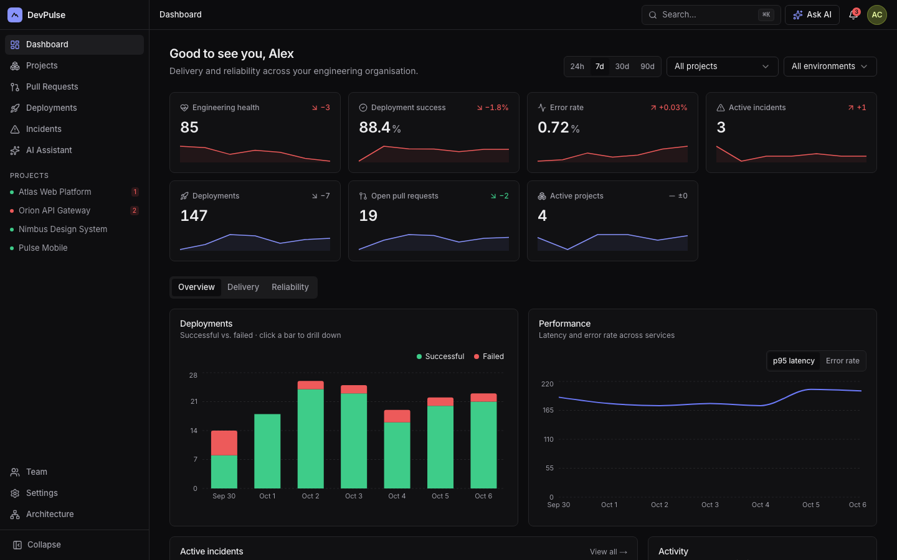
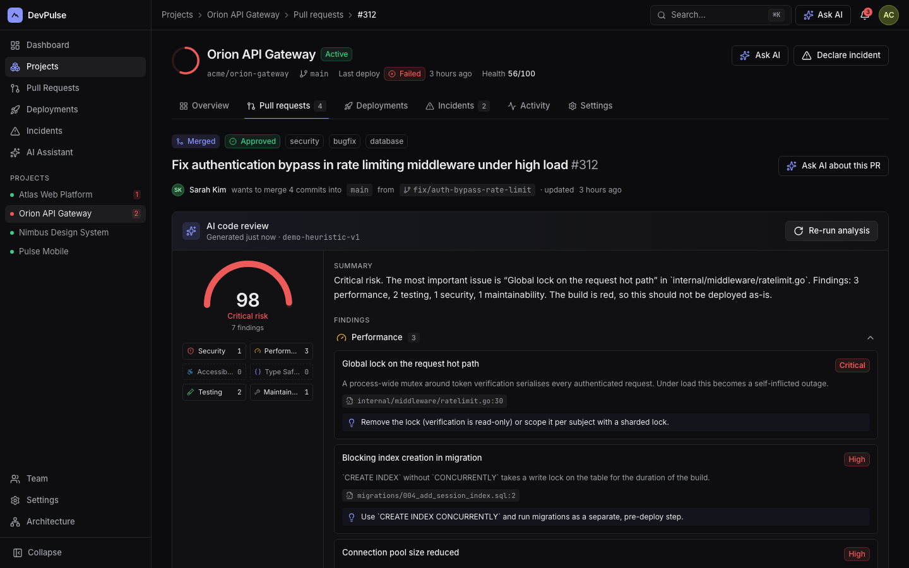
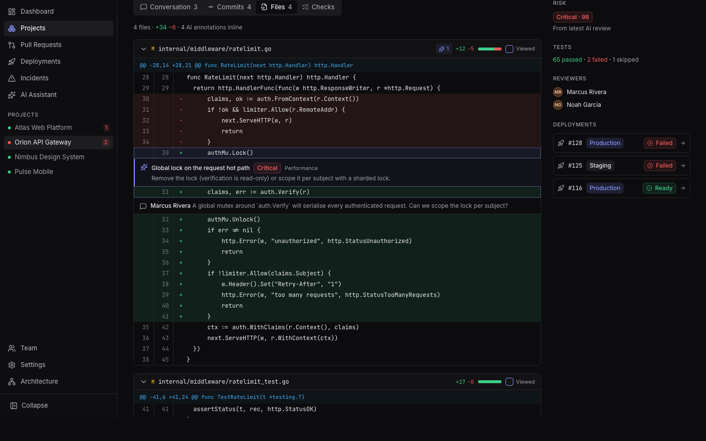
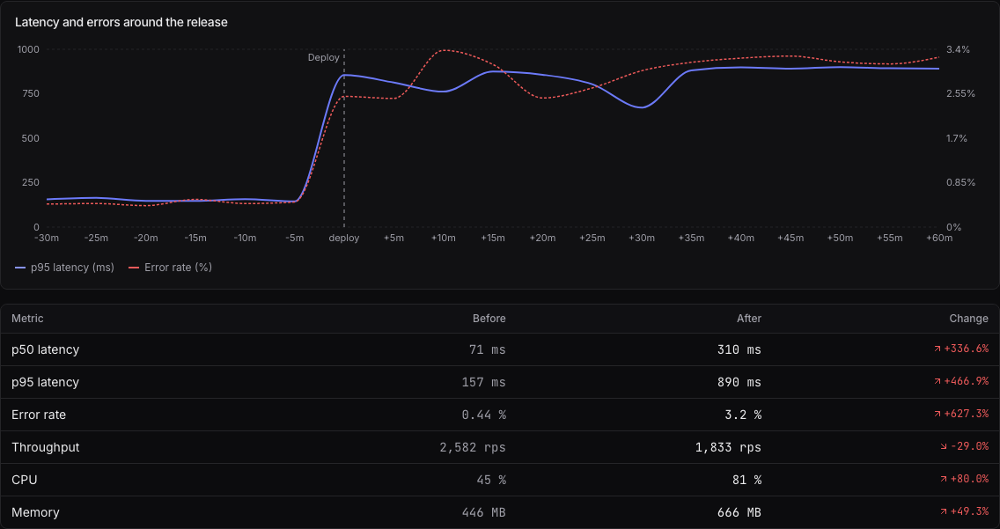
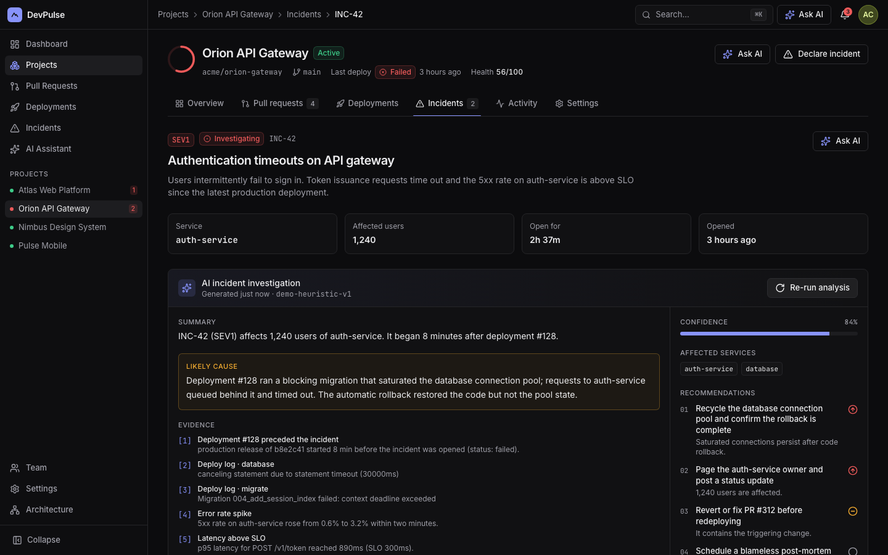
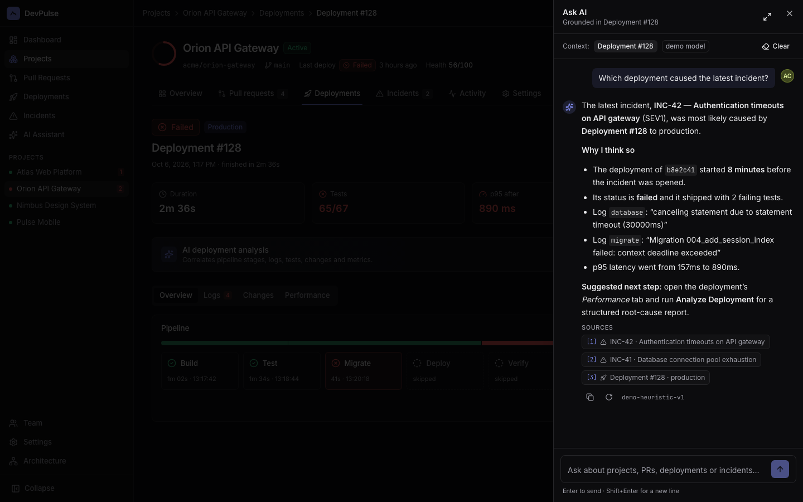
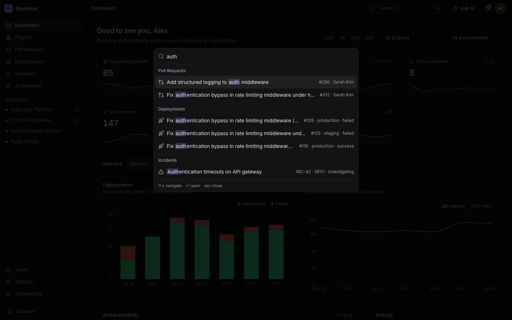
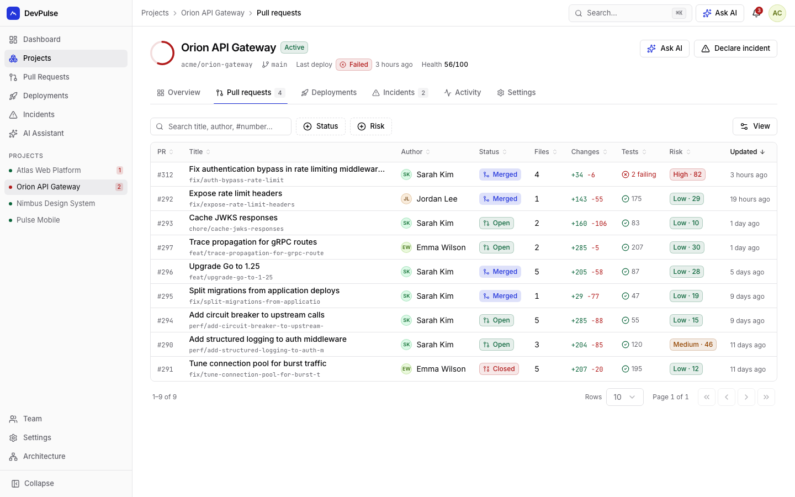
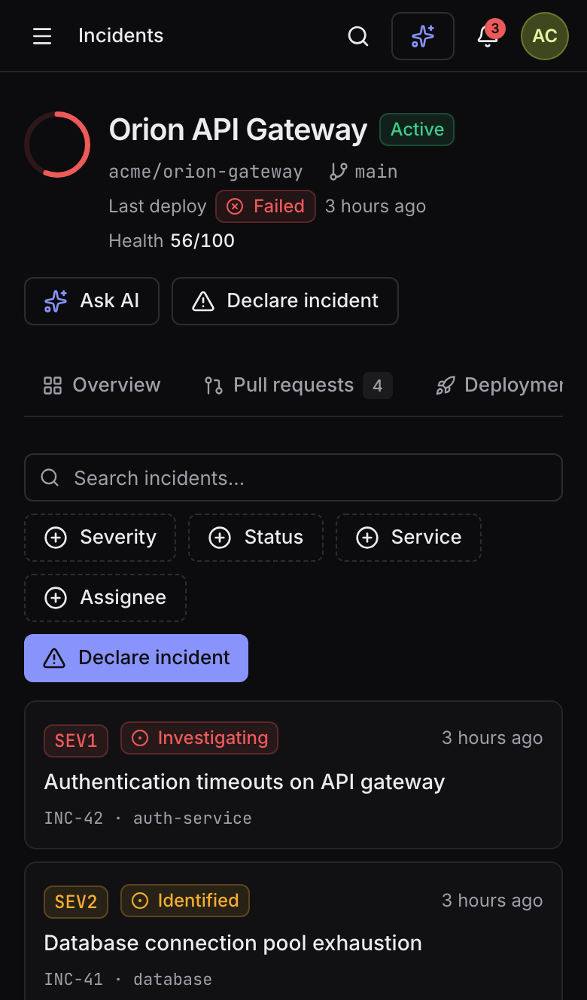

# DevPulse

[](https://github.com/yagomateos/DevPulse/actions/workflows/ci.yml)

**Live demo: [devpulse-hq.vercel.app](https://devpulse-hq.vercel.app)** · sign in with `demo@example.com` / `demo123`.

DevPulse is an AI engineering workspace for software teams: projects, pull requests, deployments and incidents, with AI analysis built into each of those workflows.

The project is a **frontend engineering showcase**. Most of the work is in the React and Next.js architecture: composition, state ownership, data fetching, forms, a reusable data table, accessibility, performance and tests. The backend stays deliberately small. Its only job is to support the UI behind a typed seam that can be swapped out.

> **Demo login:** `demo@example.com` / `demo123`. In demo mode (the default) you choose a role (Admin, Manager or Developer) at sign-in and can switch it later from the user menu to explore RBAC. With `DEMO_MODE=false` the role always comes from the member record — see [Security model](#security-model).
> The app runs **fully offline**: in-memory data and a deterministic demo AI model. Add an `AI_API_KEY` to use a real LLM.

## Highlights

- **Next.js 16 App Router done properly:** Server Components that stream and hydrate the TanStack Query cache, nested layouts, route-level loading/error/not-found with real HTTP 404s, Route Handlers, Server Actions and a `proxy.ts`.
- **A reusable `<DataTable />`:** server or client mode, URL-synced filters/sorting/pagination, column visibility, selection, keyboard navigation and mobile cards. Used on five screens.
- **AI as product features, not a chatbot:** structured PR / deployment / incident analyses rendered as components (risk gauge, grouped findings *inline in the diff*, evidence, recommendations), plus a context-aware assistant that streams and cites its sources.
- **Verified quality:**
  - 115 Vitest tests and 17 Playwright tests, including an axe WCAG 2.1 AA audit in both themes;
  - Lighthouse accessibility 100 and CLS 0;
  - CI on GitHub runs everything against both the in-memory store and PostgreSQL.

## Screenshots

| | |
| --- | --- |
|  |  |
| **Dashboard.** URL-driven filters, KPIs with drill-down, lazy-loaded charts. | **AI code review.** Structured output rendered as components, not text. |
|  |  |
| **Findings inline in the diff**, next to human review comments. | **Deployment performance** before and after the release. |
|  |  |
| **Incident investigation:** likely cause, linked evidence, confidence. | **Ask AI panel.** Knows the page you are on, streams and cites sources. |
|  |  |
| **⌘K palette:** commands plus grouped, highlighted global search. | **Light theme** and the reusable DataTable. |

<p align="center"><br /><em>Mobile: drawer navigation and tables rendered as cards.</em></p>

---

## Contents

- [Highlights](#highlights)
- [Screenshots](#screenshots)
- [Demo flow](#demo-flow)
- [Tech stack](#tech-stack)
- [Architecture](#architecture)
- [Frontend architecture](#frontend-architecture)
- [React patterns](#react-patterns)
- [Next.js patterns](#nextjs-patterns)
- [State management](#state-management)
- [AI architecture](#ai-architecture)
- [GitHub integration](#github-integration)
- [Security model](#security-model)
- [Accessibility & performance](#accessibility--performance)
- [Testing](#testing)
- [Running locally](#running-locally)
- [Environment variables](#environment-variables)
- [Deployment](#deployment)

---

## Demo flow

This is the path a reviewer should take. It is covered end to end by `tests/e2e/demo-flow.spec.ts`.

1. **Sign in.** Pick a role. If you open a deep link while signed out, you come back to it after login.
2. **Dashboard.** KPIs with sparklines and drill-down links. Date range, project and environment filters live in the URL. Charts are interactive.
3. **Project → Orion API Gateway.** A nested layout with route-driven tabs: Overview · Pull requests · Deployments · Incidents · Activity · Settings.
4. **Pull request #312.** Run **Analyze with AI** and you get a structured review:
   - a risk gauge;
   - findings grouped by category (Security, Performance, Accessibility, Type Safety, Testing, Maintainability);
   - recommendations;
   - findings that point at a file and line show up *inline in the diff*.
5. **Deployment #128.** The pipeline timeline and filterable logs. **Analyze Deployment** returns a cause, evidence and recommended actions. The **Performance** tab shows a before/after comparison around the release.
6. **Ask AI.** The side panel knows which deployment you are looking at. It streams an answer that cites its sources.

---

## Tech stack

| Area | Choice |
| --- | --- |
| Framework | **Next.js 16** (App Router, Turbopack, `proxy.ts`), **React 19** |
| Language | **TypeScript** strict, plus `noUncheckedIndexedAccess` |
| UI | Tailwind CSS (design tokens, dark-first), **shadcn/ui** on Radix, Lucide, cmdk, vaul |
| Server state | **TanStack Query v5** |
| Client state | **Zustand** |
| Forms | **React Hook Form** + **Zod**. The same schemas run on the client, in route handlers and on AI output. |
| Tables | **TanStack Table v8**, wrapped in a reusable `<DataTable />` |
| Charts | **Recharts** (lazy-loaded) |
| Backend | Next.js Route Handlers + Server Actions |
| Database | **PostgreSQL** + **Drizzle ORM** (optional; in-memory by default) |
| AI | Any **OpenAI-compatible** Chat Completions API: streaming, structured outputs, tool calling |
| Testing | **Vitest**, **React Testing Library**, **Playwright**, PGlite for SQL integration tests |
| Infra | Docker (standalone output), docker-compose with Postgres, GitHub Actions |

---

## Architecture

```
Browser ─────────────────────────────────────────────────────────────────────
  Client Components  ·  TanStack Query cache  ·  URL state  ·  Zustand UI state
        ▲ hydrate (dehydrated cache)        │ fetch /api/* (typed services)
Next.js server ─────────────────────────────┼──────────────────────────────────
  proxy.ts (signed-cookie check)            ▼
  Server Components (layouts, pages, metadata, Suspense streaming)
  Route Handlers + Server Actions (Zod validation, RBAC, NDJSON AI stream)
Domain & data ───────────────────────────────────────────────────────────────
  Repository interface ──► memory (demo)  |  PostgreSQL via Drizzle
  AI module ──► OpenAI-compatible client  |  deterministic demo model
```

- **One data seam.** Server Components and Route Handlers only talk to the `Repository` interface (`src/server/repositories/types.ts`). `DATA_SOURCE=postgres` swaps the in-memory store for Drizzle without touching the UI.
- **The mock API behaves like a real network.** It has latency, random failures, server-side filtering, sorting and pagination. You can tune it in **Settings → General → Demo network conditions**, so loading, error and retry states are easy to observe.
- The in-app **`/architecture`** page documents the technical decisions and includes a diagram.

## Frontend architecture

```
src/
  app/            routes: (auth)/login, (workspace)/… nested layouts, api/ route handlers
  components/     design system (ui/), data-table/, feedback/, layout/, status/, shared/
  features/       ai · auth · dashboard · projects · pull-requests · deployments
                  incidents · team · settings · search · notifications · architecture
  hooks/          useMediaQuery, useUrlState, useHotkeys, useDebouncedValue, useNow
  lib/            http client (ApiError), query keys, permissions, formatting, forms
  services/       typed API clients + TanStack `queryOptions` factories
  stores/         Zustand: ui, command palette, AI panel context stack, dialogs, table prefs
  schemas/        Zod: forms, list queries, AI structured outputs
  server/         auth, repositories (memory | postgres), AI, db (Drizzle schema & seed)
  proxy.ts        optimistic route protection
```

- **Each feature owns its UI, hooks and logic.** Pages are thin. Most are under 40 lines and only compose feature components.
- **`components/` is shared and domain-agnostic.** It holds the design system plus cross-cutting primitives: `DataTable`, `ErrorState`, `EmptyState`, `LoadingSkeleton`, `RetryButton`, `QueryState`.
- **Business rules stay out of visual components.** Permissions live in `lib/permissions.ts`, analysis in `server/ai/heuristics.ts`, and filtering and sorting in the repositories.

## React patterns

- **Composition and render props.** `AnalysisPanel` owns the AI lifecycle (idle → progress → error → result). Each domain passes its own renderer for the result.
- **Reusable `<DataTable />`:**
  - client mode or server mode (`manual`);
  - search, faceted filters, sorting and pagination synced to the URL;
  - column visibility persisted per table;
  - row selection with bulk actions;
  - roving-tabindex keyboard navigation (↑ ↓ Home End Enter Space);
  - a card layout on mobile, plus loading, empty and error states.

  It is used for pull requests, deployments, incidents, team and projects.
- **Custom hooks:**
  - data: `useProjects`, `useProject`, `usePullRequests`, `usePullRequest`, `useDeployments`, `useDeployment`, `useIncidents`, `useIncident`, `useMetrics`;
  - AI: `useAIAnalysis`, `useChat`;
  - app-wide: `useGlobalSearch`, `useCommandPalette`, `usePermissions`;
  - browser and URL: `useMediaQuery` (`useSyncExternalStore`), `useUrlState`, `useHotkeys`.
- **Optimistic UI** with rollback for:
  - incident status changes;
  - project settings;
  - role changes and member removal;
  - marking notifications as read.
- **Controlled and uncontrolled inputs where each fits:**
  - the toolbar search is controlled, with a debounced commit to the URL;
  - forms are uncontrolled, through React Hook Form;
  - the tag input is a controlled component.
- **Derived state over effects.** Session expiry, drawer auto-close and search-input sync use the "adjust state during render" pattern instead of `useEffect` chains.
- **Context only where it fits.** The authenticated user comes from the server once, through `SessionProvider`. Server data never lives in context.

## Next.js patterns

- **App Router with nested layouts.** The project header and tabs stay mounted while the tab content changes. Tabs are real routes.
- **Server Components by default:**
  - pages read the repository directly, with no HTTP hop;
  - they seed the client cache via `<Hydrate>` (`HydrationBoundary`);
  - the dashboard streams its sections behind `<Suspense>`.

  `AppShell` itself is a Server Component that wraps small client islands.
- **Client Components only for interaction:** tables, forms, charts, the palette and chat.
- **Special files.** `loading.tsx`, `error.tsx` and `not-found.tsx` exist at the workspace, project and detail levels. `global-error.tsx` sits at the root.
- **Route Handlers.** There are 29 typed endpoints. Each validates input with Zod and maps errors to a uniform `{ error: { message, status, issues } }`.
- **Server Actions** handle login, logout, role switching and simulated session expiry.
- **`proxy.ts`** (Next 16's middleware) does an optimistic signed-cookie check and redirects to `/login?next=…` with a `reason=expired` flag. Authoritative checks happen again in layouts and handlers.
- **Metadata.** Each route has a title template, plus `generateMetadata` on dynamic routes.

## State management

| Kind of state | Owner | Examples |
| --- | --- | --- |
| Server state | **TanStack Query** | lists, details, metrics, AI analyses. Hierarchical keys in `lib/query-keys.ts`. |
| Client UI state | **Zustand** | sidebar, command palette, AI panel context stack, global dialogs, column preferences |
| URL state | **search params** | table filters, sorting and paging; dashboard range; tabs; preview drawer; assistant scope |
| Form state | **React Hook Form + Zod** | create project/incident, invite member, project settings, six settings sections, login |

URL updates go through the History API, which the App Router keeps in sync with `useSearchParams`. Filters stay shareable and still feel instant, with no server round trip.

## AI architecture

- **Structured outputs.** `prAnalysisSchema`, `deploymentAnalysisSchema` and `incidentAnalysisSchema` are Zod schemas. They are:
  - converted to strict JSON Schema for `response_format`;
  - validated on the server;
  - inferred as TypeScript types for the components that render them.
- **Tool calling.** The assistant can call `list_incidents`, `list_deployments`, `list_pull_requests`, `get_project_health` and `get_recent_activity` against the repository. Tool results become citations.
- **Streaming.** `/api/ai/chat` streams NDJSON events (`status` → `sources` → `text` → `done` | `error`). The `useChat` hook handles optimistic messages, abort and retry. Messages are memoised, so only the message being streamed re-renders on each token.
- **Contextual panel.** Pages register what the user is looking at in a context *stack*: project layout → PR page. The global **Ask AI** panel always answers about the current entity.
- **Demo model.** With no API key, a deterministic rule-based analyser reads the real diff, checks, logs and timeline. It returns output that satisfies the same schemas. This keeps the app useful offline and the tests deterministic.

## Security model

- **Sessions.** Stateless, HMAC-SHA256-signed, `httpOnly` + `SameSite=Lax` cookies with an 8 h expiry. `AUTH_SECRET` is mandatory for production builds (there is no built-in fallback).
- **Authorisation.** `lib/permissions.ts` is the single permission matrix. `<PermissionGate>` hides UI; every route handler and server action re-checks with `requirePermission()` (Playwright verifies the 403).
- **Demo mode (`DEMO_MODE`, on by default).** Unlocks portfolio conveniences: choosing your role at sign-in, switching roles, simulating session expiry and per-request network switches (`x-mock-network`, `?__fail=1`). `DEMO_MODE=false` disables all of them and takes the role from the member record.
- **Abuse and CSRF.** Failed sign-ins are rate-limited per email + IP (5 per minute, in-memory per instance). State-changing API requests must come from the app's own origin, on top of `SameSite` cookies.
- **Headers.** Production responses send a Content-Security-Policy (`'self'` only; `'unsafe-inline'` for scripts because Next streams its RSC payload inline), `X-Frame-Options`, `nosniff`, `Referrer-Policy` and `Permissions-Policy`.
- **Known limits.** Tokens can't be revoked server-side (sign-out clears the cookie), the rate limiter is per instance, and demo passwords live in memory.

## Accessibility & performance

**Accessibility**
- Semantic landmarks and a skip link.
- `aria-sort` on table headers, live regions for streaming, and labelled dialogs and drawers (focus trap and restore come from Radix).
- Full keyboard support:
  - the palette (`⌘K`, `/`) and `g` + key navigation;
  - table rows and timeline filters;
  - `aria-pressed` toggles on interactive controls.
- Visible focus rings, AA-contrast colour tokens in both themes and `prefers-reduced-motion` support.

**Accessibility audit**
- `tests/e2e/a11y.spec.ts` runs **axe-core** (WCAG 2.0/2.1 A + AA) on the login page and 12 workspace screens in both themes, with zero violations. Fixes it drove: AA contrast for semantic tokens and avatars, no opacity-dimmed text, screen-reader data tables for every chart, ARIA roles.
- Lighthouse accessibility: **100** on every measured page.

**Performance**
- Server rendering and streaming; every client query a page needs is hydrated *above* its consumers, so pages server-render with data (CLS **0**).
- `next/dynamic` for Recharts, the markdown renderer and dialog forms; charts additionally mount only when scrolled into view (`LazyMount`, IntersectionObserver).
- `import * as z from 'zod'` lets the bundler drop Zod's locale files (−58 kB gzip on every form page); `jitless` mode keeps Zod compatible with the CSP.
- `next/font` with `display: optional` (no late font-swap repaint), `optimizePackageImports`, chart animations off, `useDeferredValue` for log filtering, debounced and abortable search, query caching.

Measured on the production build (`npm run build && npm start`, mobile emulation):

| Page | Lighthouse perf (simulated / observed) | A11y | Best practices | CLS | First-load JS (gzip) |
| --- | --- | --- | --- | --- | --- |
| `/login` | 99 | 100 | 100 | 0 | 240 kB |
| `/dashboard` | 88 / 91 | 100 | 100 | 0 | 425 kB (incl. charts) |
| `/projects` | 87 | 100 | 100 | 0 | 291 kB |
| PR #312 | 88 | 100 | 100 | 0 | 342 kB |
| Deployment #128 | 88 | 100 | 100 | 0 | 271 kB |
| INC-42 | 95 | 100 | 100 | 0 | 317 kB |
| `/architecture` | 90 / 98 | 100 | 100 | 0 | 256 kB |

Lighthouse's simulated mode reports LCP ≈ 3.3–3.9 s on workspace pages; with observed (DevTools) throttling LCP equals FCP at ≈ 1.7 s. SEO is intentionally low: the app sends `noindex`. Roughly 110 kB of every first load is React + the Next.js runtime.

## Testing

```bash
npm test              # Vitest: unit + component + SQL integration (133 tests, coverage ratchet)
npm run test:coverage
npm run test:e2e      # Playwright: journeys + axe audit, desktop & mobile (17 tests)
```

- **Live LLM path** is tested against a fake OpenAI-compatible provider: strict JSON schema in the request, Zod validation of the response (502 on mismatch), the tool-calling loop with citations, SSE streaming and provider errors.
- **Unit tests** cover permissions, schemas, time-zone formatting, the session token (including tampering and expiry), login rate limiting, notification preferences, mock integrations, the memory repository and the demo AI model. A separate test parses NDJSON split across network chunks.
- **Component tests** (RTL + user-event) cover behaviour, not just rendering:
  - DataTable: sorting, debounced search, facets, column visibility, keyboard navigation, selection, loading and error states;
  - PR detail: AI analysis, jumping from a finding to the diff, error and retry;
  - IncidentTimeline: filtering and expanding events;
  - the dashboard metric grid: URL-driven query, error recovery;
  - the create-incident form: client and server validation;
  - the projects grid/list toggle;
  - `PermissionGate`, `useChat` (streaming and retry) and `useMediaQuery`;
  - the Combobox, command palette, general settings, team optimistic rollback, login form and prompt input;
  - the route-handler wrapper (error mapping, origin check) and the proxy.
- **SQL integration test.** It applies the generated Drizzle migration to **PGlite**, a real Postgres engine running as WASM, seeds it and checks that the Postgres repository behaves like the in-memory one.
- **Playwright journeys:**
  - login and redirect-back, invalid credentials, login rate limiting, unauthorised API access, logout;
  - real HTTP 404 responses for missing records;
  - RBAC, checked in both the UI and the API;
  - dashboard filters and drill-down;
  - the full demo flow;
  - declaring an incident from the command palette;
  - AI incident investigation;
  - global search with the keyboard;
  - mobile drawer and card layouts.

Each run starts from a clean dataset (a dev-only / token-protected reset endpoint is called in Playwright's global setup). The journeys pass against `next dev`, against the standalone production build (`npm run build && npm start`, as CI runs them) and against the Docker image backed by PostgreSQL.

## Running locally

Requirements: Node.js ≥ 22 (24 recommended).

```bash
npm install
npm run dev          # http://localhost:3000 — sign in with demo@example.com / demo123
```

Quality gate:

```bash
npm run validate     # lint + typecheck + unit tests
npx playwright install chromium && npm run test:e2e
```

### With PostgreSQL

```bash
docker compose up -d db
cp .env.example .env.local    # set DATA_SOURCE=postgres
npm run db:migrate && npm run db:seed
npm run dev
```

Or run the whole stack in containers:

```bash
export AUTH_SECRET=$(openssl rand -hex 32)
docker compose up -d db
docker compose run --rm migrate    # apply migrations + seed (dedicated migrator image)
docker compose up -d --build app   # http://localhost:3000 (APP_PORT to change it)
```

## Environment variables

All variables are optional. See [`.env.example`](.env.example).

| Variable | Purpose |
| --- | --- |
| `AUTH_SECRET` | HMAC key for session cookies. **Required for production builds.** |
| `DEMO_MODE` | `true` (default) or `false`. See [Security model](#security-model). |
| `DATA_SOURCE` | `memory` (default) or `postgres` |
| `DATABASE_URL` | Postgres connection string |
| `GITHUB_TOKEN` | Fine-grained token (Pull requests + Checks, read-only) for the GitHub sync. Optional for public repos. |
| `GITHUB_WEBHOOK_SECRET` | Shared secret for verifying GitHub webhook signatures. Without it the webhook returns 503. |
| `CRON_SECRET` | Bearer token Vercel Cron sends to `/api/cron/github-sync` |
| `AI_API_KEY` / `AI_BASE_URL` / `AI_MODEL` | Any OpenAI-compatible endpoint. Without a key, the demo model is used. |
| `MOCK_NETWORK=off` | Disables simulated latency and failures (used in tests) |
| `INSECURE_COOKIES=true` | Allows the session cookie over plain HTTP (local Docker) |

## Deployment

- **Vercel (live demo).** Deployed to `fra1` with **Neon Postgres** from the Vercel Marketplace (`DATA_SOURCE=postgres`), so all serverless functions share state. A daily **Vercel Cron** calls `/api/test/reset` (authorised with `CRON_SECRET`) to restore the demo projects. Projects created by users (such as real repositories synced from GitHub) and their data are kept; test runs still use a full reset. A second cron reconciles the GitHub sync. Required env vars: `AUTH_SECRET`, `DATA_SOURCE`, `DATABASE_URL` (provisioned by the integration), `CRON_SECRET`, plus `GITHUB_WEBHOOK_SECRET` / `GITHUB_TOKEN` for the GitHub sync.
- **Node hosting.** `npm run build && npm start`. The build emits Next.js `standalone` output and copies its static assets; `npm start` runs `node .next/standalone/server.js` (honours `PORT`/`HOSTNAME`). Set `AUTH_SECRET` and, optionally, the AI and database variables.
- **Docker.** A multi-stage `Dockerfile` produces a ~310 MB non-root `runner` image with a healthcheck, plus a `migrator` image that applies Drizzle migrations and seeds data.
- **CI.** `.github/workflows/ci.yml` runs lint, typecheck and unit tests with coverage; then the production build plus Playwright against both the in-memory store and a PostgreSQL service; and builds both Docker images. All jobs pass on GitHub Actions.

The in-memory store resets when the server restarts. Use `DATA_SOURCE=postgres` for persistent data.
